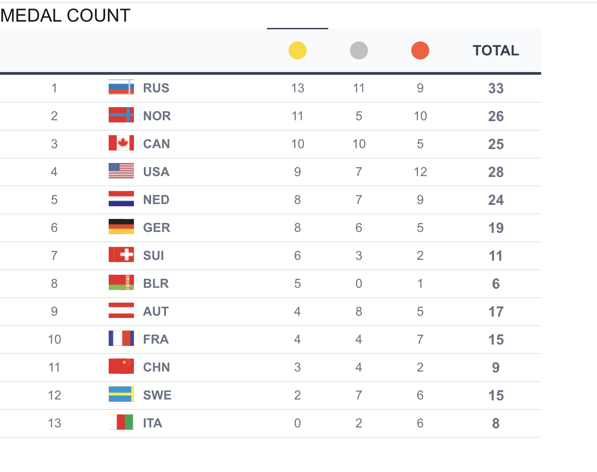
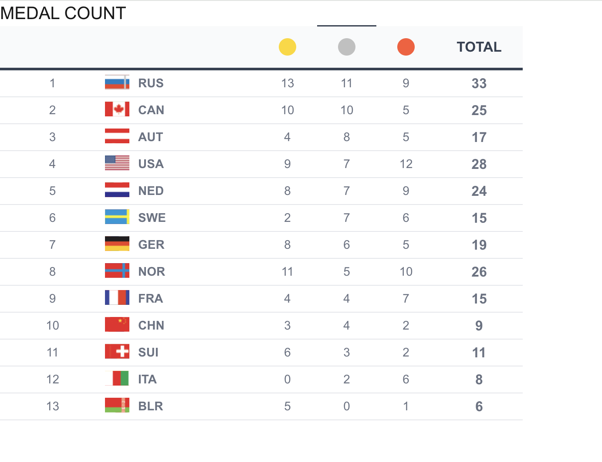
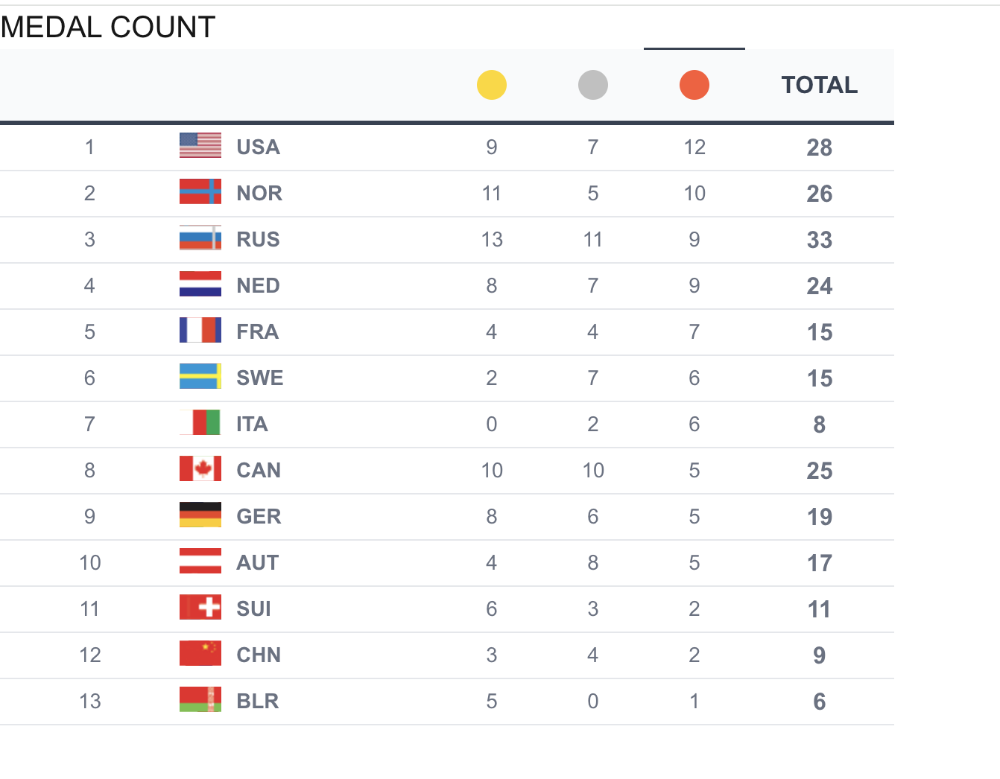
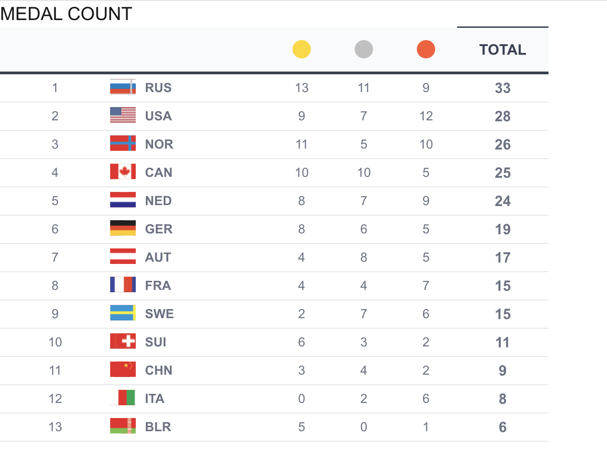
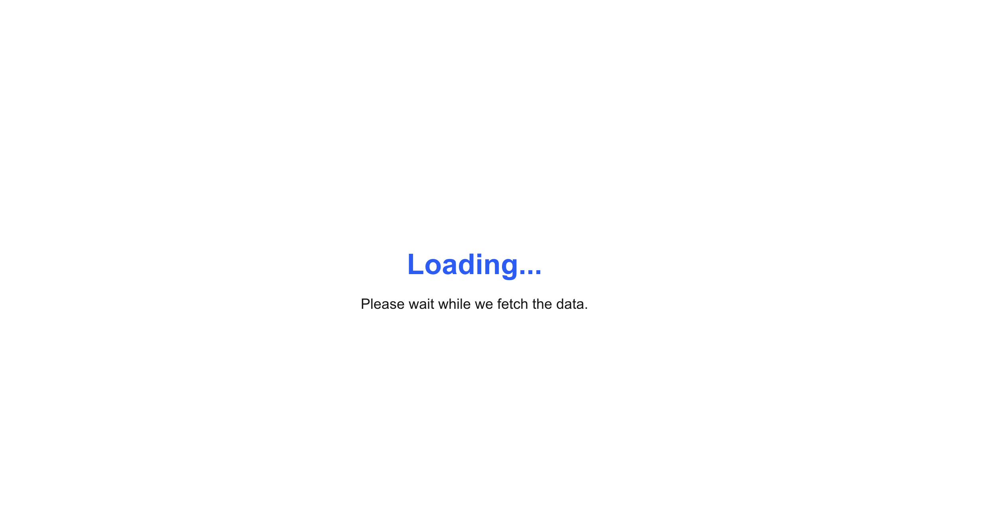
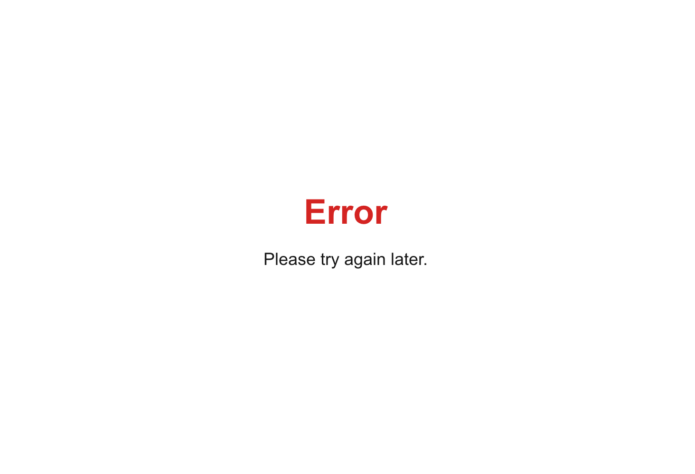
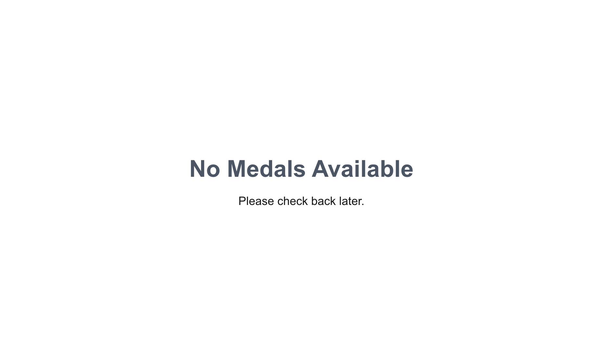

This is a [Next.js](https://nextjs.org) project bootstrapped with [`create-next-app`](https://nextjs.org/docs/app/api-reference/cli/create-next-app).

## Getting Started

First, run the development server:

```bash
npm run json-server
npm run dev
# or
yarn dev
# or
pnpm dev
# or
bun dev
```

Open [http://localhost:3000](http://localhost:3000) with your browser to see the result.


To run the error scenario, don't run  `json-server`  command to see the error screen.

To update json, please check `mocks/medals.json`. For the purpose of a mock api, `json-server` needs objects of array. If you require updating, please maintain structure.


## Sort By Gold



## Sort By Silver



## Sort By Bronze



## Sort By Total



## Loading screen



## Error screen



## No Medals screen

